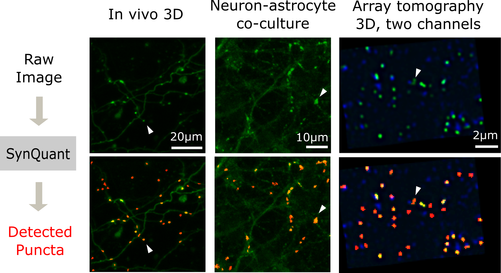

# Welcome to SynQuant
SynQuant is a Fiji plugin that automatically quantify synapses from multi-channel fluorescence microscopy images. 

SynQuant is especially suitable for data with:
1. **Heterogeneous syanspes** with different sizes and brightness.
2. **Imperfect anti-body** that is not always inside the synapes. This may look like some diffusing signals in neurites.

Both synapse and corresponding dendrite are detected. Synapses are detected on synapse channel, where they act as puncta surrounded by highly inhomogeneous interference signals. Dendrite is extracted from the reference dendrite channel.

# Getting started
1. Download the Fiji plugin [here](https://github.com/yu-lab-vt/SynQuant/releases).
2. Put the downloaded jar file to the plugin folder of Fiji.
3. Open Fiji and load the data. Then open SynQuantVid from the plugins menu.

For more details, download our user guide [here](https://drive.google.com/file/d/1YND2SoC8yUhU6LBVBY-8TO1Wul8f0TnO/view?usp=sharing).

# Synthetic data and real data in [1]
The experiments in [1] were done on both synthetic data and real data. The codes for generating synthetic data and detailed analysis for both synthetic and real data can be found [here](https://github.com/yu-lab-vt/SynQuant-data).

# Example data for testing SynQuant
Example data for testing SynQuant plugin can be found [here](https://drive.google.com/drive/folders/1IZS_1Vp3o54NBx0doTdjhUTt_hvUxi9b?usp=sharing).

# Algorithm overview
SynQuant detect synapses through a totally unsupervised probability principled framework. In this framework, analysis is conducted on salient regions rather than pixels. All synapse candidates are scored by their own local contrast and compared fairly with each other. What’s more, false discover rate (FDR) control is utilized to determine synapse selection, which not only controls the false positive rate but also provides a statistical evidence of the detected synapse. The parameter used in this framework is only the value of FDR which is easy to tune. The framework of synapse detection algorithm now is based on the idea of component tree. SynQuant extracts dendrite by steerable filter. Extracted dendrite then are segmented into roughly homogeneous pieces by branch points and end points. Based on the dendrite pieces and synapses, linear regression is used to find the effects of dendrite’s properties to the number of synapses on it.

# Updates
Version 1.1
* Add the component tree structure for synapse detection suggested by Dr.Petter Ranefall. 3 times faster than before
* Output ROI regions overlaid with original synaptic data. Quantification can be done based on detected synapses or synaptic sites.

Version 1.2
* Allow for the detection of pre-, post-synaptic puncta and synaptic sites.
* Add the function of combining pre-, post-synaptic puncta detection results.
* Support of puncta detection for both 2D and 3D data in the same plugin.
* Add one more noise estimation/stabilization method.
* Add two more input parameters for user to tune their targets' shapes.
* Add a slider for user to post-process results based on z-score.

# Reference
[1] Yizhi Wang, Congchao Wang, Petter Ranefall, Gerard Broussard, Yinxue Wang, Guilai Shi, Yue Wang, Lin Tian, Guoqiang Yu, *SynQuant: An Automatic Tool to Quantify Synapses from Microscopy Images*, BioRxiv 538769; doi: https://doi.org/10.1101/538769

